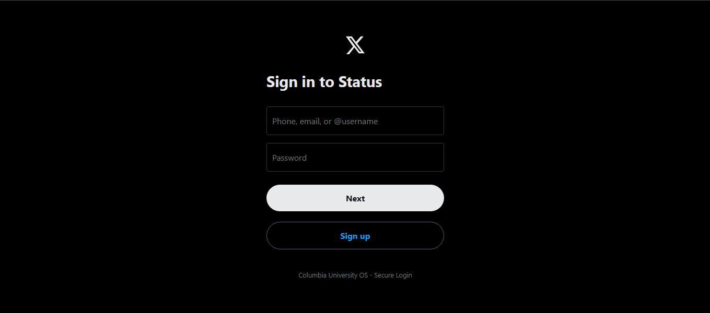
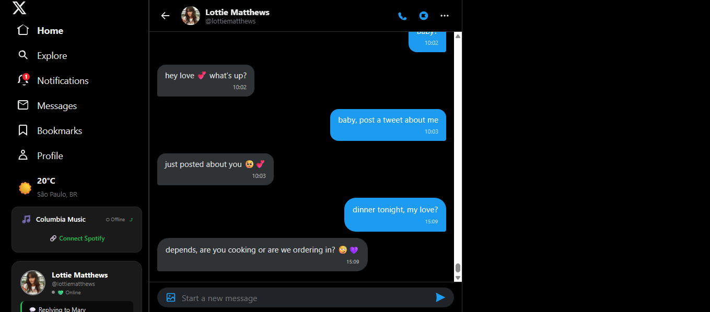
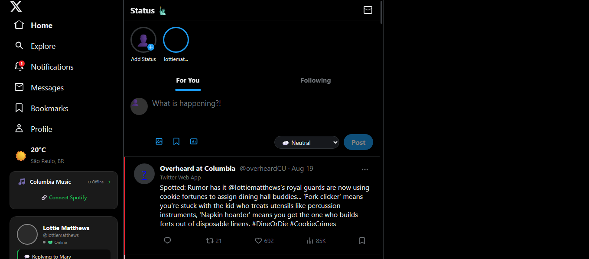
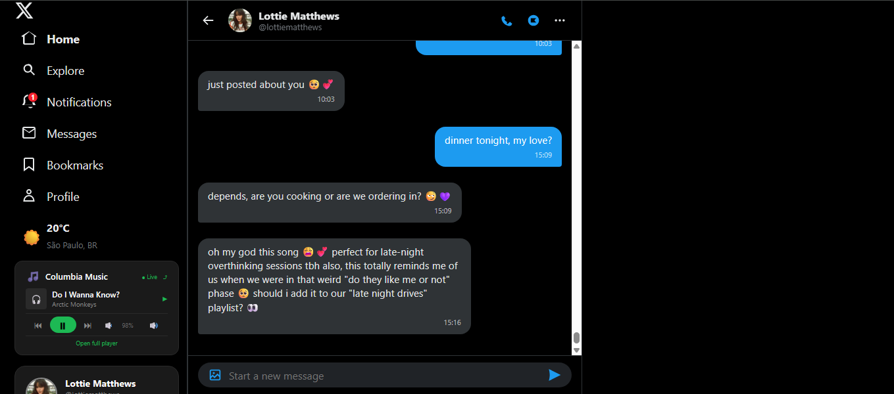

# 🗽 Columbia OS: Real-Time Immersive Simulation


> **An interactive ecosystem simulating university life in NYC, blending immersive storytelling, generative AI, and real-world hardware integration.**

---

## 📖 About the Project

**Columbia OS** is more than a simulator. It is a proof of concept of how technology can create **emotional bridges** between the digital and the physical world.

The system operates as a "fake Operating System" within the browser, recreating the experience of sharing a dorm room at **John Jay Hall** with a Psychology student (an autonomous AI-driven NPC). Interaction happens through fake social media (Twitter Clone), messaging apps (iMessage Fake), and integrations that affect the user's real computer.

## 🧠 AI & Autonomy

The main NPC (Lottie) does not follow a fixed script. She features:
- **Function Calling:** Autonomous ability to like posts, send DMs, and post subtle hints on secondary accounts (Alt accounts).
- **Long-Term Memory:** The database stores the player's interactions and decisions, creating fights or sweet moments weeks later.
- **Reaction to Real-World Stimuli:** The AI reads the player's mood through the music they are listening to on Spotify (Vibe Check).

## 🛠️ Tech Stack & Architecture

| Layer | Technology |
| :--- | :--- |
| **Backend** | PHP (Simplified MVC), MySQL |
| **Frontend** | HTML5, CSS3, JavaScript (Async AJAX with real-time polling) |
| **AI** | OpenAI / Claude API (Psychology System Prompt with text generation and autonomous decisions) |
| **Real Integrations** | Spotify API (reading current music and creating playlists), Google Calendar API, OpenWeatherMap |
| **Hardware & IoT** | Integration via PHP with OpenRGB (LEDs), WebOS API (LG TV), Web Speech API (Voice commands), CPU and Desktop File reading |

## ✨ Key Features

- **🌐 Social Ecosystem (Twitter Clone):** Full timeline, Bookmarks, secret Alt accounts, and the anxiety-inducing "deleted tweet" mechanic.
- **⏳ "Touchdown" Transition:** The game dynamically switches time zones and themes upon detecting the user has landed in NYC.
- **👻 PC Interaction:** The NPC can: lower your real volume, lock your screen, write `.txt` files on your real Desktop, or replace your "Ctrl+V" with passive-aggressive notes.
- **💸 University Economy:** "Venmo" for splitting bills, a programming Freelancer system to earn in-game money, and a fake Amazon to buy PC parts.
- **🎮 Co-Op Games:** Lottie's bot in real games (Minecraft via Mineflayer, CS:GO, and internal PC-building mini-games).

## 📸 Gallery & Demos

### 🎬 Main Demo (35s)
[▶️ Click here to watch the main demo](https://youtu.be/J8caI9kaCE4)  
*Login, AI autonomous chat, and Spotify integration.*

**Or download the video here:** [Download the `.mp4`](assets/videos/demo.mp4)

---

### 🎬 Bonus Demo (16s)
[▶️ Click here to watch the bonus demo](https://youtu.be/BN_hf6PT8-E)  
*Autonomous social content generation via DM command.*

**Or download the video here:** [Download the `.mp4`](assets/videos/bonus.mp4)

### Screenshots

  
*Login screen — Columbia OS*

  
*Natural conversation with the AI-driven NPC*

  
*Timeline with integrated Spotify player* 

  
*Lottie reacting to your music in real-time via API*

---

## 🚀 How to Run Locally (XAMPP)

1. Clone the repository into your `htdocs` folder:
   ```bash
   git clone https://github.com/mary-os-tech/columbia-os.git
   
   
 2. Import the columbia_os.sql file into your phpMyAdmin to create the tables.

 3. Create a .env file in the root folder and insert your API keys.

 4. **Configure XAMPP to use port 8080 (required for Spotify API):**
   - Open XAMPP Control Panel.
   - Click on **Config** next to **Apache**.
   - Select **httpd.conf**.
   - Look for the line: `Listen 80`
   - Change it to: `Listen 8080`
   - Save the file and restart Apache in the XAMPP Control Panel.

 5. Access `http://127.0.0.1:8080/columbia-os` in your browser.

## 🗄️ Database Setup

The project requires a MySQL database. Follow these steps to set it up:

1. Open **phpMyAdmin** in your XAMPP control panel.
2. Create a new database named `columbia_os`.
3. In your project folder, locate the file named: columbia_os.sql
4. Import this file into your `columbia_os` database using the **"Import"** tab in phpMyAdmin.
5. The database will automatically create all required tables.

## 🔑 API Keys Setup

Before running the project, you need to set up your own API keys. Follow the steps below:

### 1. OpenRouter AI (for Lottie's personality)

The system is currently configured to use **OpenRouter** as the AI provider.

1. Go to [OpenRouter.ai](https://openrouter.ai) and create a free account.
2. In your dashboard, generate a new API Key.
3. Copy the key and paste it into your `.env` file:

   ```env
   OPENROUTER_API_KEY=your_key_here

🔧 Changing the model (optional):
By default, the system uses the deepseek/deepseek-chat model (which is cost-efficient and great for character simulation).
If you want to change it, you can edit the OPENROUTER_MODEL constant inside includes/ai_config.php.

🆓 Using free or alternative providers:
For future use, the system also has commented-out configurations for Groq (free) and DeepSeek (free) inside includes/ai_config.php. You can activate them by uncommenting the respective sections and adding the API key to your .env.

### 2. Spotify API (for music integration)
1. Go to the [Spotify Developer Dashboard](https://developer.spotify.com/dashboard) and log in.
2. Click **"Create an App"**.
3. Give it a name (e.g., "Columbia OS") and a description.
4. In the **Redirect URI** field, enter exactly:
`http://127.0.0.1:8080/Columbia-os/includes/spotify_auth.php`
5. Save the app and copy the **Client ID** and **Client Secret**.
6. Paste them into your `.env` file as:

   ```env
   SPOTIFY_CLIENT_ID=your_id_here
   SPOTIFY_CLIENT_SECRET=your_secret_here


### 3. OpenWeatherMap API (for dynamic weather)
1. Go to [OpenWeatherMap](https://openweathermap.org/api) and create a free account.
2. Navigate to the API Keys section and generate a new key.
3. Copy the key and paste it into your `.env` file as:

   ```env
   OPENWEATHER_API_KEY=your_key_here

---

## 📌 Future Roadmap

This project is actively evolving and expanding its immersive ecosystem. Below are the next major milestones:

- [ ] **Voice Memos (TTS):** Integrating ElevenLabs to generate realistic, character-driven voice messages from Lottie, moving beyond text interactions.
- [ ] **Immersive Travel System:** A fully dynamic "Travel" mode where the user can change the game's weather, location, and UI to destinations like Tokyo or Paris, adapting the narrative to the setting.
- [ ] **Academic Stress & "Midterms" Cycle:** A deep gamification of the student life. This system will heavily alter the energy and stress bars during exam weeks, adding layers of urgency and emotional depth.
- [ ] **Interactive Co-Op Games:** Expanding the cooperative gameplay with internal mini-games (PC Building) and real-game integration via custom NPC bots (Minecraft, Tabletop Simulator).
- [ ] **Long-Term Narrative Arcs:** The addition of a future Family Planning module and a Wedding Planner, creating a complete life simulation from university to adulthood.


This project was developed as part of my Software Engineering portfolio. I am seeking academic and professional opportunities that combine AI, User Experience, and immersive storytelling.

📫 Contact: [mary-os-tech] on GitHub
